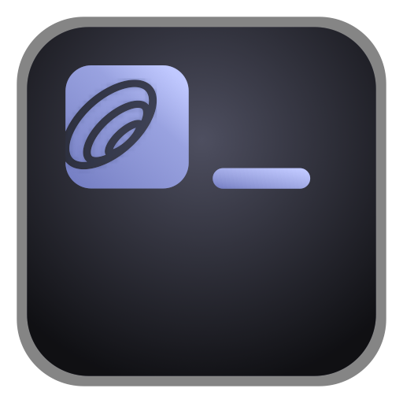

<p align="center">
  
</p>

# Comms CLI

A command-line interface for Comms.

## Installation

> ```bash
> npm install -g @doist/comms-cli
> ```

### Agent Skills

Install skills for your coding agent:

```bash
tdc skill install claude-code
tdc skill install codex
tdc skill install cursor
tdc skill install gemini
tdc skill install pi
tdc skill install universal
```

Skills are installed to `~/<agent-dir>/skills/comms-cli/SKILL.md` (e.g. `~/.claude/` for claude-code, `~/.agents/` for universal, etc.). When updating the CLI, installed skills are updated automatically. The `universal` agent is compatible with Amp, OpenCode, and other agents that read from `~/.agents/`.

```bash
tdc skill list
tdc skill uninstall <agent>
```

## Uninstallation

First, remove any installed agent skills:

```bash
tdc skill uninstall <agent>
```

Then uninstall the CLI:

```bash
npm uninstall -g @doist/comms-cli
```

## Local Setup

```bash
git clone https://github.com/Doist/comms-cli.git
cd comms-cli
npm install
npm run build
npm link
```

This makes the `tdc` command available globally.

## Setup

```bash
tdc auth login
```

This opens your browser to authenticate with Comms. Once approved, the token is stored in your OS credential manager:

- macOS: Keychain
- Windows: Credential Manager
- Linux: Secret Service/libsecret

If secure storage is unavailable, the CLI warns and falls back to `~/.config/comms-cli/config.json`. Non-secret settings such as the current workspace remain in the config file.

### Alternative methods

**Manual token:**

```bash
tdc auth token
```

The CLI prompts for the token without echoing it. Do **not** pass the token as a positional argument — it would be visible in `ps` / shell history.

**Environment variable:**

```bash
export COMMS_API_TOKEN="your-token"
```

`COMMS_API_TOKEN` always takes priority over the stored token.

### Auth commands

```bash
tdc auth status   # check if authenticated
tdc auth logout   # remove saved token
```

## Usage

```bash
tdc inbox                           # inbox threads
tdc inbox --unread                  # unread threads only
tdc mentions                        # content mentioning you
tdc mentions --since 2026-04-01 --all --json
tdc thread view <ref>               # view thread with comments
tdc thread view <ref> --comment 123 # view a specific comment
tdc thread reply <ref>              # reply to a thread
tdc thread rename <ref> "New title" # rename a thread
tdc thread update <ref> "New body"  # edit a thread's body (first post)
tdc conversation unread             # list unread conversations
tdc conversation view <ref>         # view conversation messages
tdc msg view <ref>                  # view a conversation message
tdc search "keyword"                # search across workspace
tdc search "keyword" --all          # fetch all result pages
tdc react thread <ref> 👍          # add reaction
tdc away                            # show away status
tdc away set vacation 2026-03-20    # set away until date
tdc away clear                      # clear away status
tdc groups                          # list groups in a workspace
tdc groups view <ref>               # show a group with members
tdc groups create "Frontend"        # create a group
tdc groups create "FE" --users alice@doist.com,bob@doist.com
tdc groups rename <ref> "New name"  # rename a group
tdc groups delete <ref> --yes       # delete a group
tdc groups add-user <ref> alice@doist.com bob@doist.com
tdc groups remove-user <ref> id:123,id:456
```

References accept IDs (`123` or `id:123`), Comms URLs, or fuzzy names (for workspaces/users).

Run `tdc --help` or `tdc <command> --help` for more options.

## Shell Completions

Tab completion is available for bash, zsh, and fish:

```bash
tdc completion install        # prompts for shell
tdc completion install bash   # or: zsh, fish
```

Restart your shell or source your config file to activate. To remove:

```bash
tdc completion uninstall
```

## Machine-readable output

All list/view commands support `--json` and `--ndjson` flags for scripting:

```bash
tdc inbox --json                    # JSON array
tdc inbox --ndjson                  # newline-delimited JSON
tdc inbox --json --full             # include all fields
```

## Development

```bash
npm install
npm run build       # compile
npm run dev         # watch mode
npm run type-check  # type check
npm run format      # format code
npm test            # run tests
```
